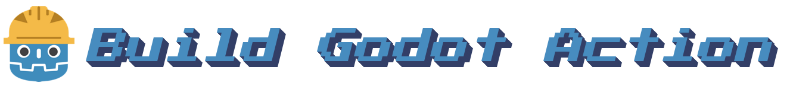

 



This action builds the godot project in your `$GITHUB_WORKSPACE`, so that you can easily automate builds.

Table of Contents:
- [Quickstart](#Quickstart)
- [Usage](#Usage)
- [Contributors](Contributors.md)

## Quickstart

### Step 1: Configure Export Presets

In Godot create export templates for `linux`, `windows`, and `mac`.

The name of the Windows export would be of type `Windows Desktop` and have the name `windows`. For Mac, the name would `mac` and type `Mac OSX`. Then for linux, `Linux/X11`

Once you verify that `export_presets.cfg` is located in the same directory as your `project.godot` file, you can push your changes.

### Step 2: Setup Worfklow on GitHub

Add the following workflow file to your repository. An example file name would be `.github/workflows/build.yml`

```yaml
name: Build Godot Project

on:
  push: {}
  pull_request: {}

jobs:
  Godot:
    runs-on: ubuntu-latest
    strategy:
      matrix:
        platform: [linux, windows, mac]
    steps:
      - uses: actions/checkout@v4.1.4
        with:
          lfs: true
      - name: Build
        id: build
        uses: manleydev/build-godot-action@v1.5.0
        with:
          name: example
          preset: ${{ matrix.platform }}
          debugMode: "true"
      - name: Upload Artifact
        uses: actions/upload-artifact@v4
        with:
          name: Client - ${{ matrix.platform }}
          path: ${{ github.workspace }}/${{ steps.build.outputs.build }}
```

#### Workflow Explaination

This workflow has three steps:
- **Checkout**: The Checkout step clones the project on the GitHub actions runner.
- **Build**: This step uses this action to build the Godot project.
- **Upload Artifact**: The Upload Artifact step uploads the output from the build step.

**Matrix Explaination**: The matrix object runs the job for EACH possible value. So in this job, we are using a `platform` matrix to automatically run our workflow for the values `linux`, `windows`, and `mac`.

#### Simple Changes

##### Change Exports

In this workflow, since it's using a matrix you can just add or remove export names from the `platform` matrix. The value being passed MUST have the same name as the preset.

```yaml
  Godot:
    runs-on: ubuntu-latest
    strategy:
      matrix:
        platform: [win32, win64] # This project will only export using the export presets `win32` and `win64`
```

Additionally if you are not using a matrix, you can set the export preset as the parameter `preset`:

```yaml
      - name: Build
        id: build
        uses: manleydev/build-godot-action@v1.4.1
        with:
          name: example
          preset: win32
```

##### Change Project Name

To change the export name, you can the `name` parameter to whatever you want your project to export as.

```yaml
      - name: Build
        id: build
        uses: manleydev/build-godot-action@v1.4.1
        with:
          name: test # This project will export with the name "test"
```

##### Disable Debug Mode

This example is set to build with debug mode enable. To disable debug, either set `debugMode` to `false` or remove the field entirely.

```yaml
      - name: Build
        id: build
        uses: manleydev/build-godot-action@v1.4.1
        with:
          name: example
          preset: ${{ matrix.platform }}
          debugMode: "false" # This project will not build in debug mode
```

##### Change Project Directory

If your project is located in a subdirectory, you can use the `projectDir` to change build directories.

```yaml
      - name: Build
        id: build
        uses: manleydev/build-godot-action@v1.4.1
        with:
          name: example
          preset: ${{ matrix.platform }}
          projectDir: "test" # The project in the `test` directory will be built
```


### Step 3: Test your workflow!

Now, whenever you make a push or pull request in that repository, GitHub Actions will build . You see and download your project in the `Actions` tab of your repository.


## Usage

This action will create a `build` folder an outputed build. You must have the export preset configured for the target platform to successfully export.

Example:

```yaml
steps:
- uses: manleydev/build-godot-action@[VERSION]
  with:
    name: godot-project
    preset: HTML5
```

### Inputs

#### name **required**

    The name of the exported package/binary

#### preset **required**

    The name of the preset found in `export_presets.cfg` you would like to build.

#### subdirectory

    *Optional*

    The subdirectory in the `build` folder to output build to, can be useful for self packaging.

#### package

    *Optional*

    Boolean value, when set to true, builds artficat zip file.

#### projectDir

    *Optional*

    Directory in workspace containing your godot project.

#### debugMode

    *Optional*

    Boolean value, when set to true, runs export in debug mode.

### Outputs

#### build

    The location the outputed build is placed relative to GitHub Workspace.

#### artifact

    The location the outputed artifact is placed relative to GitHub Workspace.
